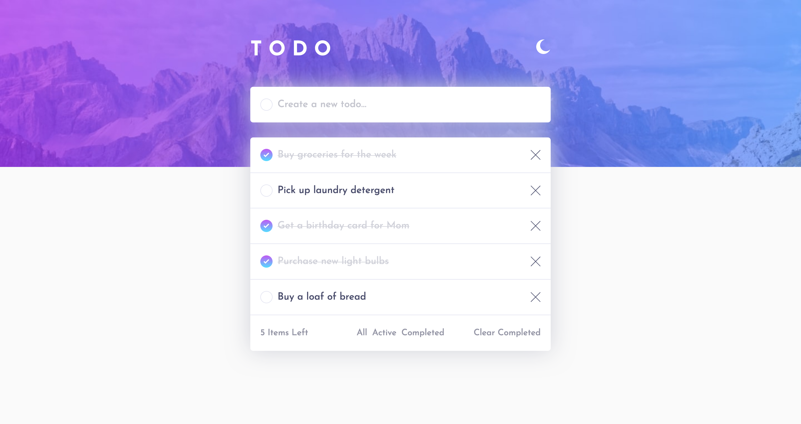

# Frontend Mentor - Todo app solution

This is a solution to the [Todo app challenge on Frontend Mentor](https://www.frontendmentor.io/challenges/todo-app-Su1_KokOW). Frontend Mentor challenges help you improve your coding skills by building realistic projects.

## Table of contents

- [Overview](#overview)
  - [The challenge](#the-challenge)
  - [Screenshot](#screenshot)
  - [Links](#links)
- [My process](#my-process)
  - [Built with](#built-with)
  - [What I learned](#what-i-learned)
  - [Continued development](#continued-development)
- [Author](#author)

## Overview

### The challenge

Users should be able to:

- See hover states for all interactive elements on the page
- Add new todos to the list
- Mark todos as complete
- Delete todos from the list
- Filter by all/active/complete todos
- Clear all completed todos
- Toggle light and dark mode

### Screenshot

### Links

- Solution URL: [https://github.com/RyanNolan1/react-to-do-list](https://github.com/RyanNolan1/react-to-do-list)
- Live Site URL: [https://ryans-react-to-do-list.netlify.app/](https://ryans-react-to-do-list.netlify.app/)

## My process

### Built with

- HTML
- CSS
- JavaScript
- Mobile-first workflow
- [React](https://reactjs.org/) - JS library

### What I learned

I learned a ton about ReactJS whilst making this project, focusing on:

- Utilising useState and lifting up state
- Structuring Components for better organisation 
- Using props efficiently
- Using the Ternary Operator for conditional rendering

### Continued development

In the future I will continue to practice using useState, useEffect, Components and Ternary Operators.

## Author

- Website - [http://ryannolan.uk/](http://ryannolan.uk/)
- LinkedIn - [ryan-nolan1](https://www.linkedin.com/in/ryan-nolan1/)

